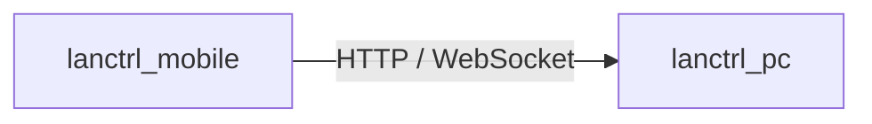

# LanCtrl (Local Network Control)

一个用于在局域网内通过手机控制电脑的轻量级系统。



## 📦 子项目

- **lanctrl_pc**：运行在电脑上的原生后台服务（核心）。
- **lanctrl_mobile**：基于 Flutter 的移动端控制应用。

## ✨ 核心功能

- **🚀 设备控制**
  - 远程关机、重启、睡眠。
- **🔐 安全配对**
  - 首次连接需输入配对码。
  - 配对成功后生成 Token。
  - 所有请求基于 Token 鉴权。
- **📂 文件访问（基于系统能力）**
  - 获取电脑共享目录列表。
  - 通过 SMB 协议访问文件（不自研文件传输协议）。
- **📜 操作日志**
  - 记录所有操作行为（时间、类型、来源设备、执行结果）。

## 🛡️ 设计特点

- **🏎️ 高性能 (PC端)**
  - 常驻内存占用极低。
  - CPU 空闲占用接近 0。
- **🧩 解耦与稳定**
  - 核心服务与 UI 解耦，后台服务长期稳定运行。
- **🔒 安全性**
  - 强制鉴权机制，Token 加密存储。
  - 支持能力级权限控制。
- **📈 可扩展性**
  - 系统设计上支持新功能模块扩展（插件化）。
  - 支持多设备接入。
  - 协议支持平滑升级（HTTP → WebSocket → gRPC）。

## 🛠️ 技术架构

### PC端 (lanctrl_pc)
- **技术栈**: [Rust](https://www.rust-lang.org/)
- **说明**: 原生实现，高性能后台常驻服务，提供 HTTP / WebSocket API，直接调用系统能力。

### 移动端 (lanctrl_mobile)
- **技术栈**: [Flutter](https://flutter.dev/) (Dart)
- **说明**: 跨平台开发，作为远程控制客户端。

## 🎯 项目目标

LanCtrl 旨在打造一个可以持续扩展的：**个人局域网设备控制中心**。

- 完成基础设备控制（关机 / 重启 / 睡眠）
- 实现设备安全配对
- 提供共享目录访问入口
- 实现基础日志系统

## 📂 目录结构

```text
.
├── lanctrl_pc        # PC端核心服务 (Rust)
└── lanctrl_mobile    # 移动端应用 (Flutter)
```
